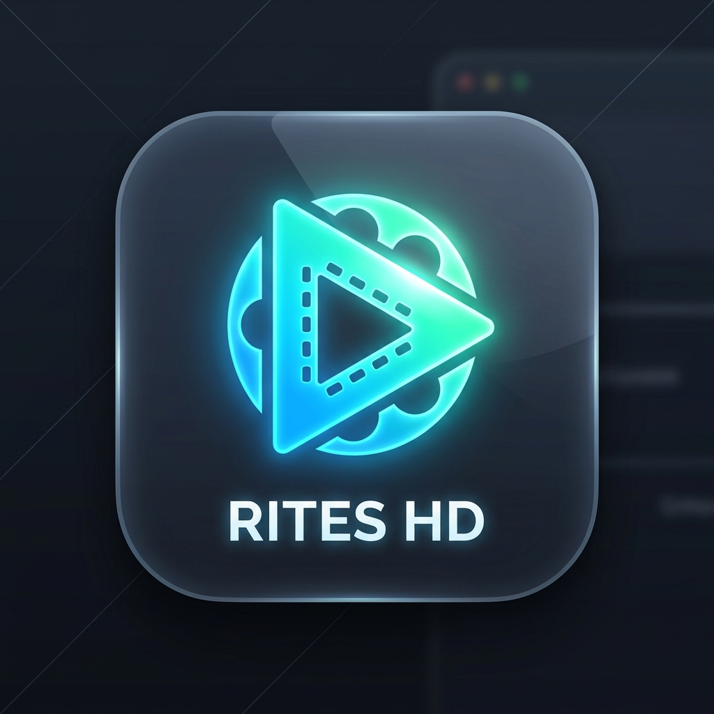

# ✨ Rites HD - Video Converter & Compressor

  

  <strong>A modern, powerful, and local video converter & compressor desktop application for Windows.</strong>

  
  
  
  

---

## 🌟 Overview

**Rites HD** is a cross-platform/Windows desktop video processing studio powered by **Electron**, **Express**, and **FFmpeg**. It gives you a clean, futuristic dark glassmorphism interface to convert, compress, crop, and trim videos in batches—completely offline and locally without uploading sensitive media to third-party cloud services.

---

## 🚀 Key Features

- **⚡ Batch Processing**: Drag-and-drop multiple local video files or paste a batch list of direct video URLs.
- **✂️ Visual Cropping**: Interactive cropping tool powered by CropperJS with presets for `1:1`, `16:9`, `9:16`, `3:4`, `2:3`, and custom aspect ratios.
- **⏱️ Precision Video Trimming**: Set start and end cut points with 0.1-second precision synced directly to the video preview.
- **🎞️ Multiple Format & Codec Support**:
  - **MP4 (H.264)** - Universal compatibility
  - **MP4 (HEVC / H.265)** - High-efficiency next-gen compression
  - **WebM (VP9)** - Web-optimized open video
  - **GIF** - High-quality animated GIFs
  - **Keep Original** - Preserve original container format
- **📐 Resolution Scaling**: Scale to `1080p (FHD)`, `720p (HD)`, `480p (SD)`, `360p`, or keep original dimensions.
- **🎛️ Quality & Compression Profiles**:
  - `High` (Highest quality preservation)
  - `Medium` (YouTube-style, optimal balance)
  - `Low` (High compression, reduced file size)
  - `Extreme` (Maximum file size reduction)
- **📊 Real-Time Progress**: Live Server-Sent Events (SSE) progress bar with detailed FFmpeg status logs.
- **🔄 Dynamic Port Allocation**: Eliminates port conflicts by dynamically allocating free system ports with automatic `EADDRINUSE` fallback.
- **📂 One-Click Output Access**: Open your processed videos folder (`~/Videos/VideoStudioOutputs`) directly from the UI.
- **☕ Built-In Creator Support**: Support the creator with the in-app Buy Me a Coffee modal and mobile-scannable QR code.

---

## 📸 Screenshots & Preview

  
   
  <em>Scan with your phone to support development!</em>

---

## 🛠️ Tech Stack

- **Desktop Framework**: [Electron](https://www.electronjs.org/)
- **Backend**: [Node.js](https://nodejs.org/), [Express](https://expressjs.com/)
- **Media Engine**: [FFmpeg](https://ffmpeg.org/) via `fluent-ffmpeg`, `@ffmpeg-installer/ffmpeg`, `@ffprobe-installer/ffprobe`
- **Frontend**: Vanilla HTML5, Modern CSS (Glassmorphism), JavaScript (ES6+), [Cropper.js](https://fengyuanchen.github.io/cropperjs/)
- **Packaging**: `electron-builder` (NSIS installer for Windows)

---

## 📥 Installation & Setup

---

## ☕ Support the Developer

If you find **Rites HD** helpful, please consider supporting the project:

- ☕ **Buy Me a Coffee**: [buymeacoffee.com/ritesh.dev](https://buymeacoffee.com/ritesh.dev)
- 💼 **Connect on LinkedIn**: [Ritesh Mehrotra](https://in.linkedin.com/in/ritesh-mehrotra-dev95)

---

## 📄 License

This project is licensed under the [ISC License](LICENSE).
FFmpeg is licensed under the LGPL/GPL licenses (see `ffmpeg/LICENSE`).
